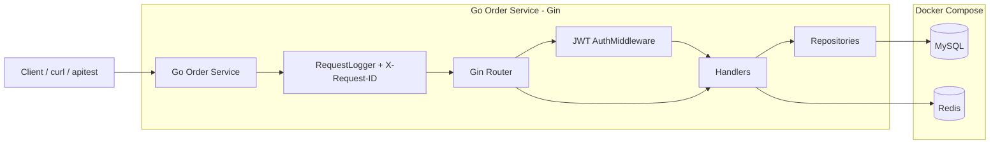
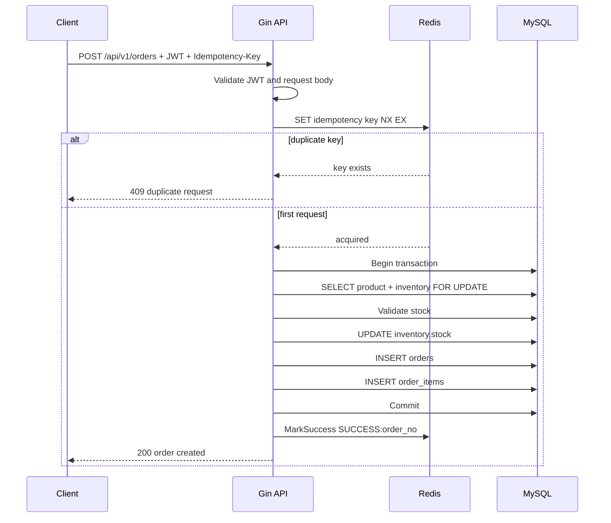
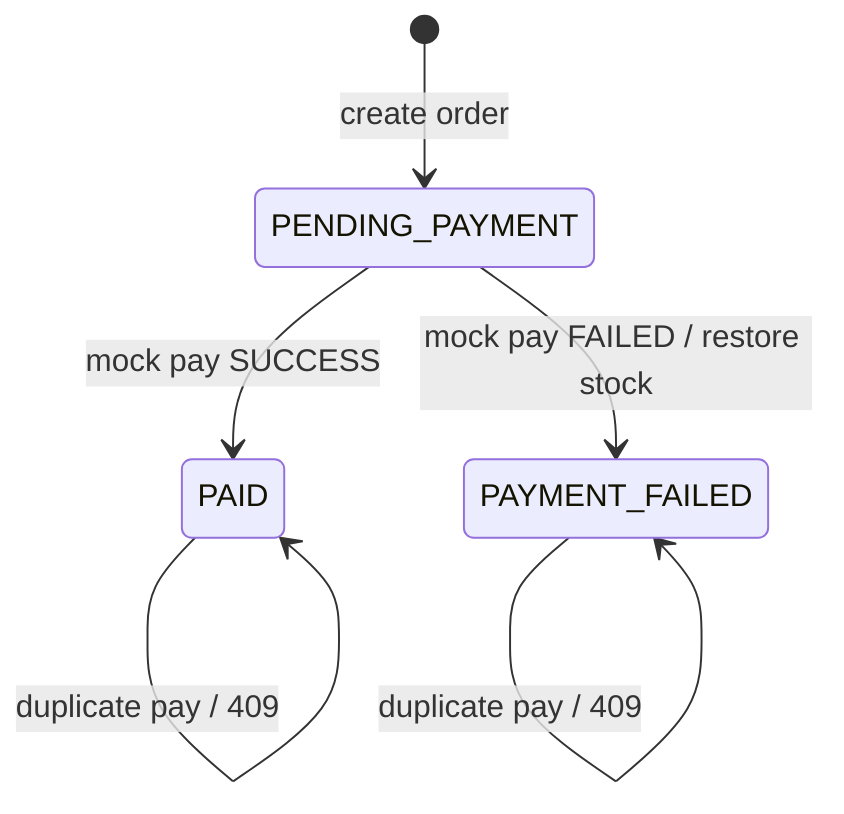

# 系统架构说明

本文档用于快速说明 Night-Hawk 的整体结构、订单创建链路和支付状态流转，方便面试官或协作者不读代码也能理解项目设计。

## 1. 系统架构图

### 说明

- `Client / curl / apitest` 代表本地调用入口、接口联调工具和自动化回归脚本
- `RequestLogger + X-Request-ID` 负责统一请求日志和请求链路标识
- `Gin Router` 负责路由分发
- `JWT AuthMiddleware` 负责保护需要登录的接口
- `Handlers` 负责参数校验、业务编排和返回响应
- `Repositories` 负责 MySQL 持久化访问
- `MySQL` 存储用户、商品、库存、订单、订单明细和支付流水
- `Redis` 当前主要用于订单创建幂等控制
- `Docker Compose` 负责把 MySQL、Redis 和 Go 服务编排到一起，便于一键启动

## 2. 订单创建流程

### 说明

订单创建的关键目标是保证“不会重复下单”和“库存一致”。

- JWT 先保证用户身份
- `Idempotency-Key` 再防止重复点击和网络重试
- Redis `SET NX` 让同一用户的同一幂等键只会成功一次
- MySQL 事务保证库存扣减、订单主表和订单明细要么一起成功，要么一起回滚
- `SELECT FOR UPDATE` 用于锁定库存行，避免并发超卖
- 事务提交后再把幂等 key 标记为成功
- 如果重复请求已经命中幂等 key，服务会直接返回 `409`

## 3. 支付状态流转

### 说明

- 新建订单后，状态默认为 `PENDING_PAYMENT`
- 调用 `/api/v1/payments/mock` 且结果为 `SUCCESS` 时，订单进入 `PAID`
- 调用 `/api/v1/payments/mock` 且结果为 `FAILED` 时，订单进入 `PAYMENT_FAILED`
- 支付失败时会恢复库存，保证账和库存的状态一致
- 对已经完成支付或已经失败的订单再次支付，会返回 `409`

## 4. 核心设计说明

### MySQL 的职责

MySQL 负责持久化 users、products、inventory、orders、order_items、payments 等核心业务数据。订单创建和支付状态流转都使用数据库事务，保证库存、订单和支付流水的一致性。

### Redis 的职责

Redis 当前用于订单创建幂等 key。服务端使用 userID + Idempotency-Key 组成 Redis key，通过 `SET NX EX` 防止用户重复点击或网络重试导致重复下单。

### JWT 的职责

JWT 用于保护需要登录的接口，例如 `/users/me`、`/orders`、`/payments/mock`。登录成功后服务端签发 token，后续请求通过 `Authorization: Bearer <token>` 访问受保护资源。

### X-Request-ID 的职责

请求日志中间件会生成或透传 `X-Request-ID`，并在响应头和日志中记录，便于排查一次请求在服务端的处理过程。

## 5. 当前边界

- 当前支付为模拟支付，不接入真实第三方支付
- 当前订单创建只支持单商品下单
- 当前重复 `Idempotency-Key` 返回 `409`，不返回第一次请求的完整响应
- 当前尚未接入消息队列
- 当前尚未做压测和 pprof 性能分析
